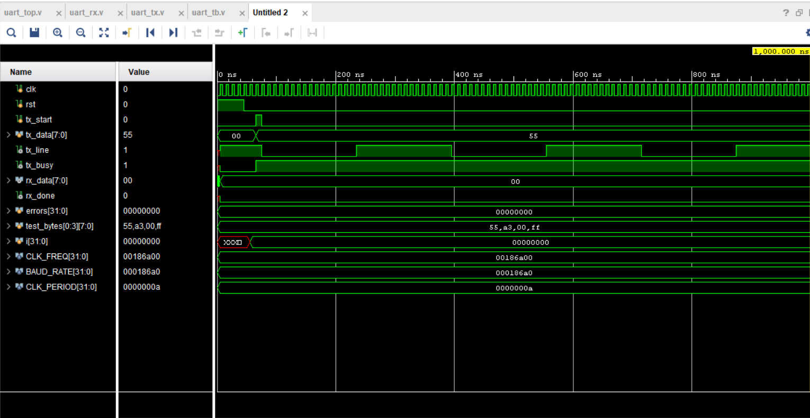

# UART Protocol Design (Verilog)

VLSI/RTL design and implementation of a **UART (Universal Asynchronous Receiver/Transmitter)** protocol in Verilog HDL, developed as part of exploring serial communication interfaces commonly used in digital and VLSI systems. UART is a widely used asynchronous communication standard that enables data exchange between devices over a single wire, without requiring a shared clock signal between the transmitter and receiver.

---

## Project Overview

The design consists of two independent modules: a **transmitter (`uart_tx`)** and a **receiver (`uart_rx`)**, both implemented as finite state machines (FSMs) following the standard UART frame format — one start bit, eight data bits (transmitted LSB first), and one stop bit. The transmitter converts parallel 8-bit data into a serial bitstream at a configurable baud rate, while the receiver reconstructs the original byte from the incoming serial line.

A key design consideration in the receiver is **mid-bit sampling**, where each bit is sampled at the center of its bit period rather than at the edges, ensuring reliable data capture even in the presence of minor timing variations. Additionally, since the incoming serial data is asynchronous with respect to the system clock, a **double flip-flop synchronizer** is used to prevent metastability issues — a critical consideration in real hardware design.

The entire design is **parameterized** for clock frequency and baud rate, making it reusable and adaptable to different system clock speeds and communication speeds without modifying the core logic. Functional correctness was verified using a **self-checking loopback testbench**, where the transmitter's output is directly connected to the receiver's input, and multiple test bytes are sent and checked against the received data to confirm accurate serial communication.

---

## UART Frame Format

```
Idle(1) → Start(0) → D0 → D1 → D2 → D3 → D4 → D5 → D6 → D7 → Stop(1) → Idle(1)
```

- **Idle** — line held at logic `1` when no data is being sent
- **Start bit** — line drops to `0` for one bit period, signaling incoming data
- **8 data bits** — sent LSB first
- **Stop bit** — line returns to `1`, marking end of frame

---

## Architecture

### Transmitter (`uart_tx`)
FSM states: `IDLE → START → DATA → STOP`
- Latches parallel data on `tx_start`
- Shifts out 8 data bits LSB-first, framed by start/stop bits
- `tx_busy` flag indicates an active transmission

### Receiver (`uart_rx`)
FSM states: `IDLE → START → DATA → STOP`
- Detects the falling edge of the start bit on the `rx` line
- Confirms the start bit at the **half-bit-period** mark (rejects glitches/noise)
- Samples each data bit at the **middle of its bit period** for reliable capture
- Uses a **double flip-flop synchronizer** on `rx` to avoid metastability
- Asserts `rx_done` for one clock cycle when a valid byte is received

### Top Module (`uart_top`)
Instantiates both `uart_tx` and `uart_rx`, exposing a single parameterized interface for integration or loopback testing.

---

## Files

| File | Description |
|------|-------------|
| `uart_tx.v` | UART transmitter module |
| `uart_rx.v` | UART receiver module |
| `uart_top.v` | Top-level wrapper instantiating tx and rx |
| `uart_tb.v` | Self-checking loopback testbench |
| `simulation_waveform.png` | Vivado simulation waveform |
| `README.md` | Project documentation |

---

## Design Highlights

- **Architecture:** FSM-based transmitter and receiver with mid-bit sampling
- **Parameterized:** Configurable `CLK_FREQ` and `BAUD_RATE`
- **Reliability:** Double flip-flop synchronizer to prevent metastability on the asynchronous `rx` line
- **Verification:** Self-checking loopback testbench with automated PASS/FAIL reporting
- **Target:** FPGA / ASIC synthesis (functionally verified via simulation)


## Simulation Result

The design was simulated and verified functionally in **Xilinx Vivado** using a loopback configuration (`tx` connected directly to `rx`).



The waveform shows `tx_data` being loaded on each `tx_start` pulse, followed by the serial bitstream on `tx_line` (start bit, 8 data bits LSB-first, stop bit). The receiver samples this stream and reconstructs the byte in `rx_data`, asserting `rx_done` once each frame completes. Across all four test bytes (`0x55, 0xA3, 0x00, 0xFF`), the received data matched the transmitted data, and the testbench reported **ALL TESTS PASSED**.

---

## Applications

- Microcontroller-to-PC serial communication
- Sensor and peripheral data interfacing
- Embedded systems debugging/logging interfaces
- General-purpose low-speed serial communication in FPGA/ASIC designs

---

## Author

Sanat Kumar Sahoo
